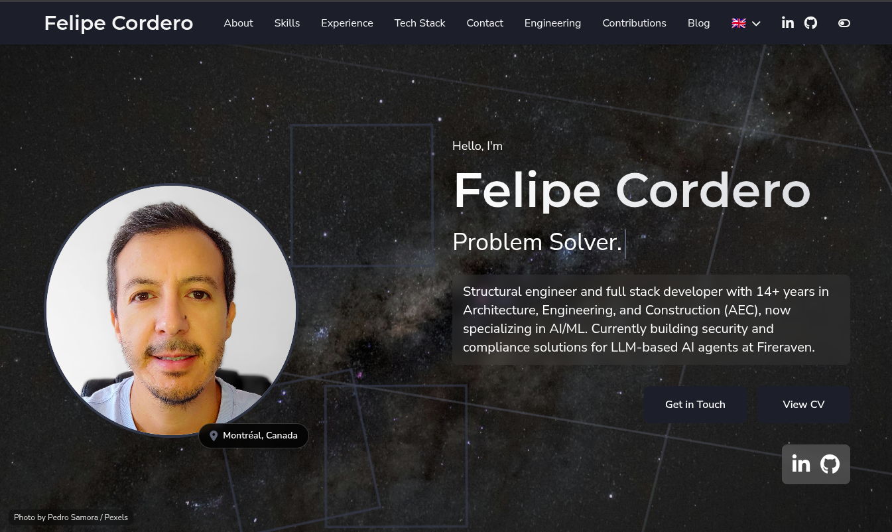

# CareerCanvas Hugo Theme

A responsive Hugo theme for personal portfolios. Dark mode, Tailwind CSS, configurable colors, portfolio galleries, blog, skills, experience timeline, contact, multilingual content support.

## Easiest way to run this theme

Use the main portfolio repository and follow its README for setup, dev server (`npm run dev`), and production build.

## Installation

This repository already vendors the theme files directly under `themes/careercanvas`.

## Configuration

Set `theme = "careercanvas"` and add `[params]` (name, tagline, profile_image, social links, resume URLs, etc.). See `example-config.toml` in this repo for a full example.

**Colors:** See [COLOR_CUSTOMIZATION.md](COLOR_CUSTOMIZATION.md).

**Gallery shortcode:** ``

## License

MIT — see [LICENSE](LICENSE).
